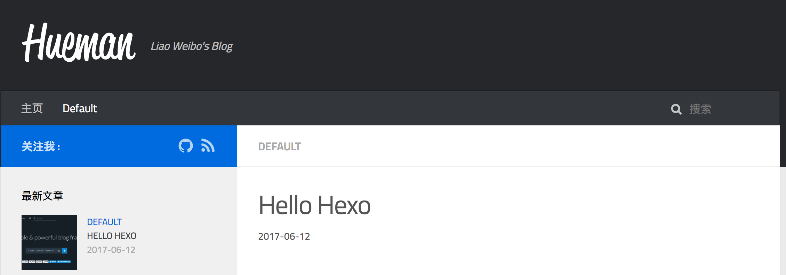

Hexo是一款简单快速的博客框架，而且可以生成静态页面快速的部署到github pages，Heroku等网站。基于nodejs引擎，有着强大的插件系统和良好的拓展性。记录我的使用过程和经验

<!-- more -->

# 环境搭建

* 环境搭建[施工中]

# 安装运行

* Hexo的安装与运行[计划中]

# 配置与主题

* Hexo配置[计划中]
* Hexo主题[计划中]

# 第一篇博客

* 使用Hexo创建文章[计划中]
* 使用Markdown撰写文章[计划中]
* 启动Server浏览文章[计划中]

# 部署到服务器

* 部署到Github Pages[计划中]
* nginx配置个人静态博客[计划中]
* ~~Github Hook与自动化部署[挖坑]~~

# 插件与拓展

* 编辑文章篇[计划中]
* ~~留言篇[挖坑]~~ 